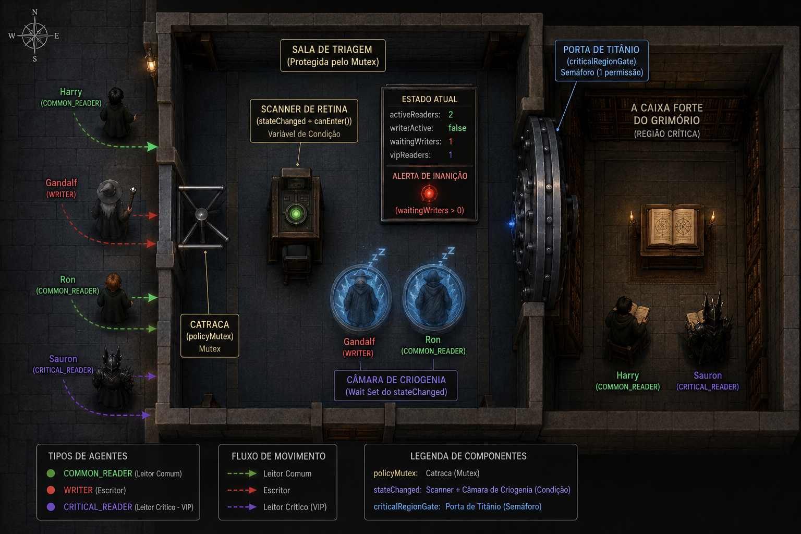

# Arcane Scriptorium

## Trabalho Acadêmico — Sistemas Operacionais

Este projeto foi desenvolvido como parte da disciplina de **Sistemas Operacionais** no curso de **Engenharia de Computação do IFSULDEMINAS**.

**Professor:** Douglas Nunes<br>
**Aluno:** Alessandro Augusto

<div align="center">


</div>

## ⚙️ Tecnologias Utilizadas

<p align="left">
  

  
</p>

* Java 21
* Maven
* JavaFX

### Descrição do Problema

Este trabalho apresenta uma solução para o clássico **Problema dos Leitores e Escritores (Readers-Writers Problem)** através de uma simulação temática denominada **Biblioteca Arcana**.

No cenário proposto, magos acessam grimórios raros armazenados em uma biblioteca mágica. Esses grimórios representam recursos compartilhados que precisam ser protegidos contra acessos concorrentes inadequados.

O sistema contempla três tipos de agentes:

* **Leitores Comuns**: realizam consultas simultâneas ao grimório.
* **Leitores Críticos**: possuem prioridade elevada de acesso.
* **Escritores**: executam modificações que exigem exclusividade total sobre o recurso.

A implementação busca garantir:

* Consistência dos dados compartilhados;
* Exclusão mútua para operações de escrita;
* Leitura concorrente segura;
* Prevenção de condições de corrida (*race conditions*);
* Mitigação de *starvation* para leitores e escritores;
* Balanceamento entre desempenho e justiça no escalonamento.

Para isso, são utilizados mecanismos de sincronização da plataforma Java, incluindo **Locks**, **Conditions** e **Semaphores**, além de políticas de prioridade controladas para leitores críticos.


## Arquitetura

```text
com.arcane.scriptorium
+-- domain            Entidades e enums do dominio
+-- events            Eventos e observadores da simulacao
+-- simulation        Ciclo de vida das threads, agentes e metricas
+-- synchronization   Coordenador de concorrencia e politica de prioridade
+-- ui.console        Renderizacao ANSI para terminal
+-- utils             Utilitarios pequenos e coesos
```

## Decisoes tecnicas

- A politica de sincronizacao fica centralizada em `ArcaneSynchronizationCoordinator`.
- As entidades concorrentes sao `Runnable`, nao subclasses diretas de `Thread`, para separar comportamento de execucao.
- O coordenador usa `ReentrantLock(true)` como mutex justo, `Condition` como filas logicas e `Semaphore` como portao da regiao critica.
- Leitores comuns compartilham a regiao critica, mas param de entrar quando ha escritor aguardando.
- Leitores criticos podem ultrapassar escritores ate o limite configurado de acessos VIP consecutivos.
- Apos um escritor executar, o privilegio VIP dos leitores criticos e restaurado.

## Compilar e executar

Com Maven e JDK 21:

```powershell
mvn compile exec:java
```

Depois que o projeto ja estiver compilado, tambem funciona:

```powershell
mvn exec:java
```

O `exec-maven-plugin` ja esta configurado para executar o modulo `com.arcane.scriptorium` e a classe `com.arcane.scriptorium.MainTerminal`.

Sem Maven, use JDK puro:

```powershell
javac -d out (Get-ChildItem -Path src/main/java -Recurse -Filter *.java).FullName
java --module-path out --module com.arcane.scriptorium/com.arcane.scriptorium.MainTerminal 15000 5
```

O primeiro argumento e a duracao da simulacao em milissegundos.
O segundo argumento e o limite maximo de leitores criticos VIP antes de um escritor ser obrigatoriamente atendido.

## Testes de concorrencia

Com Maven instalado:

```powershell
mvn test
```

Sem Maven instalado, rode a simulacao principal com JDK puro:

```powershell
javac -d out (Get-ChildItem -Path src/main/java -Recurse -Filter *.java).FullName
java --module-path out --module com.arcane.scriptorium/com.arcane.scriptorium.MainTerminal 15000 5
```

Tambem existe uma validacao standalone sem Maven e sem dependencias externas:

```powershell
javac -d out (Get-ChildItem -Path src/main/java -Recurse -Filter *.java).FullName
java --module-path out --module com.arcane.scriptorium/com.arcane.scriptorium.validation.StandaloneConcurrencyValidation
```

O documento [docs/concurrency-validation.md](docs/concurrency-validation.md) descreve os invariantes testados e as limitacoes conhecidas.

# Regras

## A Caixa Forte do Grimório

Imagine um corredor de segurança máxima.
No final dele existe uma **Porta de Titânio** (`criticalRegionGate`) protegendo o Grimório Arcano — a própria **Região Crítica** do sistema.

Antes de alcançar a porta, todo mago precisa passar por uma sala de triagem controlada por:

* **Catraca Arcana** → `policyMutex`
* **Scanner de Retina** → `stateChanged + canEnter()`
* **Porta de Titânio** → `criticalRegionGate`
* **Câmara de Criogenia** → `await()` do Java Condition



---

## Fluxo de Execução

### 1. O Primeiro Leitor

Um leitor comum entra no sistema:

* bloqueia a catraca (`policyMutex.lock()`)
* passa pelo scanner (`canEnter(COMMON_READER)`)
* aumenta `activeReaders`
* o primeiro leitor abre a porta da região crítica (`criticalRegionGate.acquire()`)

Enquanto houver leitores ativos, novos leitores podem compartilhar o acesso simultaneamente.

---

### 2. O Escritor é Bloqueado

Quando um escritor chega:

* ele passa pela catraca
* o scanner detecta leitores ativos
* o acesso é negado
* `waitingWriters++` ativa o alerta de prioridade
* a thread entra em `stateChanged.await()`

O escritor é suspenso até que a região crítica fique totalmente livre.

---

### 3. Proteção Contra Starvation

Se novos leitores comuns chegarem enquanto há escritores esperando:

* o scanner bloqueia novos leitores
* isso impede starvation dos escritores
* as threads também entram em espera (`await()`)

---

### 4. Leitores VIP Ignoram a Fila

Leitores críticos (`CRITICAL_READER`) possuem prioridade especial:

* conseguem entrar mesmo com escritores aguardando
* respeitam apenas o limite máximo configurado
* compartilham a região crítica com outros leitores

Isso simula um sistema híbrido de prioridade.

---

### 5. Saída da Região Crítica

Quando os leitores terminam:

* `activeReaders--`
* o último leitor fecha a porta (`criticalRegionGate.release()`)
* o sistema executa `stateChanged.signalAll()`

Todas as threads congeladas são acordadas.

---

### 6. Reavaliação das Threads

Após o `signalAll()`:

* todas as threads disputam novamente o mutex
* cada uma reexecuta `canEnter()`
* o escritor finalmente consegue exclusividade
* leitores posteriores voltam para espera caso necessário

---

## Objetivos do Coordenador

O `ArcaneSynchronizationCoordinator` garante:

* Exclusão mútua para escritores
* Leitura concorrente segura
* Prevenção de starvation
* Priorização controlada para leitores críticos
* Coordenação usando `Semaphore`, `Lock` e `Condition`

---

## Conceitos de Concorrência Demonstrados

| Conceito                | Implementação          |
| ----------------------- | ---------------------- |
| Exclusão Mútua          | `Mutex (policyMutex)`  |
| Região Crítica          | `criticalRegionGate`   |
| Readers-Writers Problem | Coordenação híbrida    |
| Condition Variables     | `stateChanged.await()` |
| Wake-up coletivo        | `signalAll()`          |
| Starvation Prevention   | `waitingWriters`       |
| Threads concorrentes    | Agentes arcanos        |
