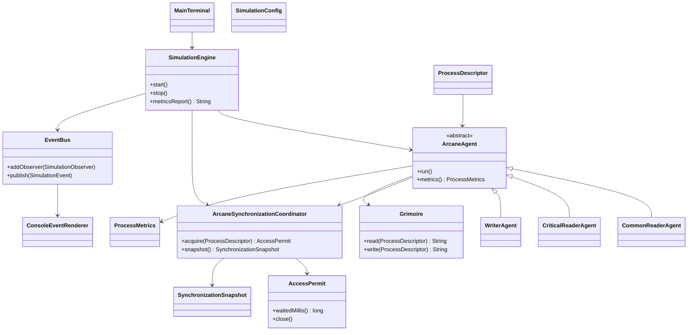

# Arquitetura Conceitual

## Diagnostico do codigo-base

O codigo inicial ja representa corretamente a intuicao do problema classico: leitores compartilham a leitura, escritores exigem exclusividade e existe uma catraca para evitar starvation do escritor.

Os principais pontos que precisavam evoluir eram:

- `Grimorio` expunha diretamente os semaforos, deixando a politica de sincronizacao espalhada entre as subclasses de `Mago`.
- O limite de leitores criticos era checado e incrementado em momentos separados, permitindo estouro do limite sob concorrencia real.
- `Semaphore` sem construtor justo usa fila nao justa por padrao.
- O metodo `down` engolia `InterruptedException`; a thread podia continuar como se tivesse adquirido o semaforo.
- As threads eram subclasses diretas de `Thread`, o que acopla regra de negocio, ciclo de vida e escalonamento.
- Nao havia uma camada dedicada para snapshots, filas, metricas e logs didaticos.

## Pacotes

```text
domain
  Modelo do problema: papeis, estados, descritores e o grimorio compartilhado.

synchronization
  Politica atomica de entrada e saida da regiao critica.

simulation
  Agentes concorrentes, configuracao, ciclo de vida das threads e metricas.

events
  Barramento de eventos para desacoplar simulacao e visualizacao.

ui.console
  Renderizacao terminal com timestamps, cores ANSI e snapshots da fila.

utils
  Utilitarios pequenos, como sorteio de duracoes.
```

## Diagrama de classes



## Politica de sincronizacao

O coordenador usa tres ideias em conjunto:

- `ReentrantLock(true)`: mutex justo para proteger contadores, filas e decisoes de escalonamento.
- `Condition`: fila logica para acordar processos quando o estado global muda.
- `Semaphore(1, true)`: portao da regiao critica, adquirido pelo primeiro leitor de um lote ou por um escritor.

Regras implementadas:

- Leitores comuns entram juntos quando nao ha escritor ativo nem escritor aguardando.
- Escritor aguardando fecha a catraca para novos leitores comuns.
- Leitor critico pode entrar mesmo com escritor aguardando, respeitando o limite VIP.
- Ao atingir o limite VIP, novos leitores criticos ficam bloqueados e o escritor passa a ter atendimento obrigatorio.
- Quando o escritor sai, o contador VIP volta a zero.
- Quando um escritor sai e ja existem leitores comuns aguardando, eles recebem um lote limitado de atendimento antes do proximo escritor, evitando starvation em cascata dos leitores comuns.
- Interrupcao durante espera cancela a tentativa de acesso e remove a thread da fila.

## Roadmap

1. Consolidar testes automatizados de invariantes concorrentes.
2. Adicionar cenarios configuraveis por arquivo ou argumentos CLI.
3. Criar painel terminal em tempo real, com renderizacao por quadro em vez de log linear.
4. Evoluir para GUI usando a mesma camada `events`, sem alterar a regra concorrente.
